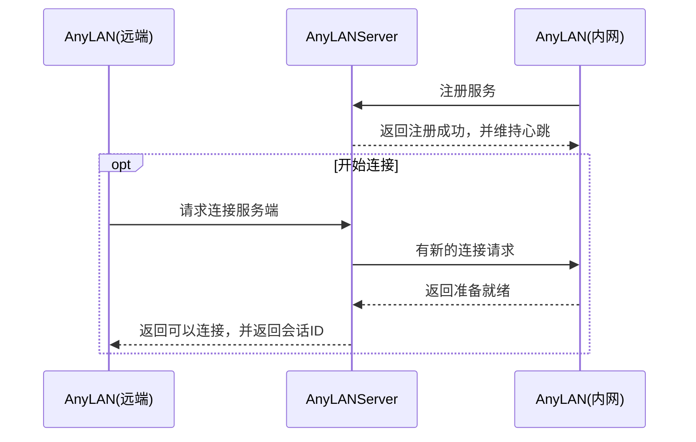
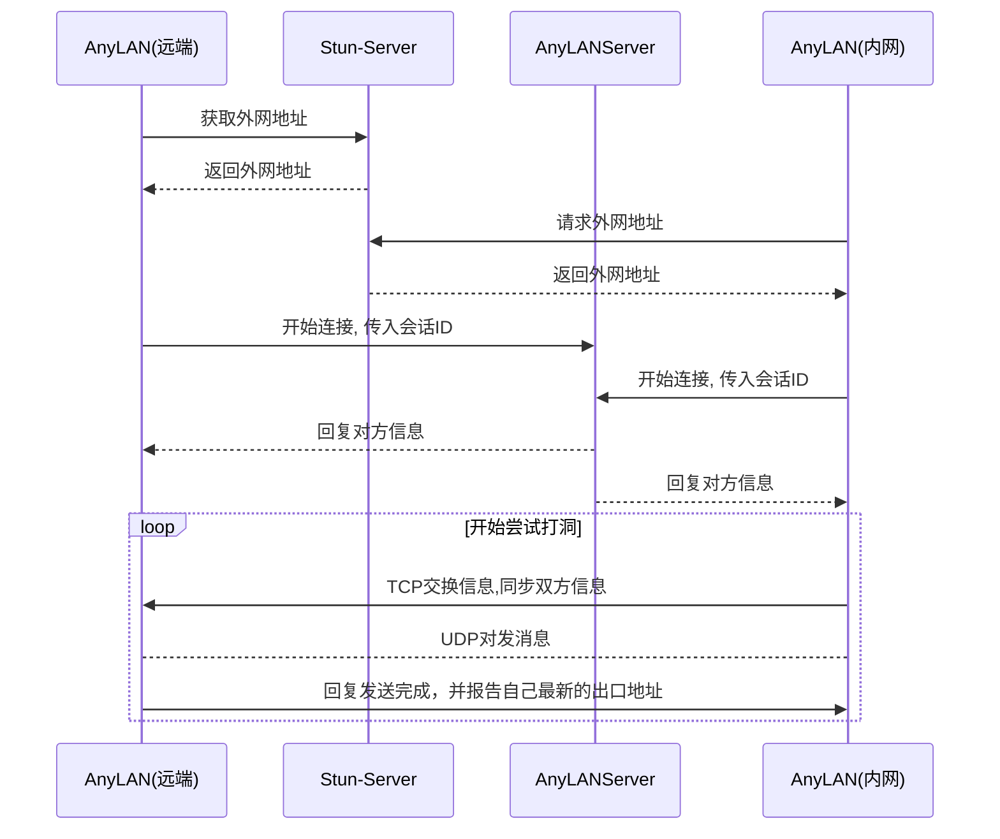

# AnyLANServer设计

# 1.文档介绍

## 1.1. 文档说明

本文档旨在说明Metadesk系统建议连接的过程

## 1.2. 参考文档

- STUN协议文档，https://www.rfc-editor.org/rfc/rfc5389

## 1.3. 其它资料

### 1.3.1. 测试可用的stun服务器

* turn2.l.google.com

# 2.AnyLANServer设计

## 2.1. 总体流程

### 2.1.1. 内网AnyLAN与AnyLANServer建立常连接设计

### 2.1.2. 会话ID交互过程

## 2.2. TCP协议设计

TCP协议采用单行json数据封装格式；不同的指令以`\r\n`区分

### 2.2.1. 通用字段说明

| json字段 | 说明     | 数据类型 | 备注                                                         |
| -------- | -------- | -------- | ------------------------------------------------------------ |
| cmd      | 消息类型 | 字符串   | req:register : 注册 res:register : 回复注册 req:hert : 心跳 res:hert : 回复心跳 req:connect : 连接 res:connect : 回复连接 req:notify : 有新连接加入 res:notify : 回复新连接加入 req:contact : 开始握手 res:contact : 回复握手 req:punch : 开始尝试互相连接 res:punch : 回复尝试互相连接 |
| sid      | 会话ID   | 字符串   | 相同的链路，会话ID必须不相同                                 |
| err      | 错误消息 | 字符串   | 出错时，显示的字符串                                         |